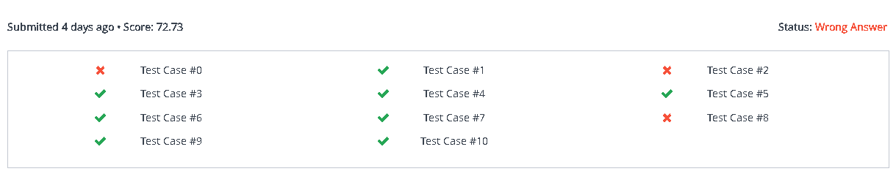

# PathInAMazeInformedSearchAnalysis
Repository for third assignment of Artificial Intelligence Class

Topic: sample input 1 from https://www.hackerrank.com/contests/noi-ph-practice-page/challenges/path-in-a-maze/problem
If the input is bigger (1000 x 1000), A Star is two times slower and use more memory than Greedy Best First Search but A Star successfully find the best solution, Greedy Best First Search mostly find the best solution but sometimes not.

### result of Greedy Best First Search (Hackerrank)

### result of A* Search (Hackerrank)

